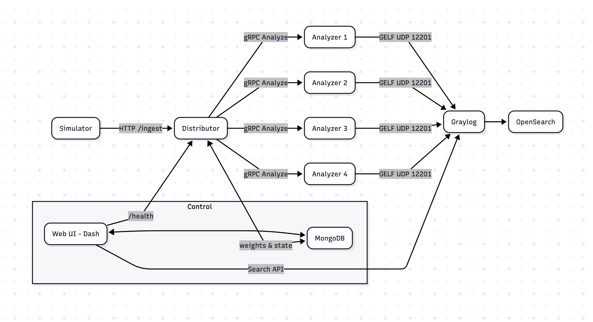

# Log Distribution & Monitoring System

A complete **multi-container** setup for simulating log traffic, distributing it across multiple analyzers by weight, and monitoring outcomes in a dashboard backed by **Graylog + OpenSearch**.

- **Simulator** generates HTTP log traffic.
- **Distributor (FastAPI + gRPC clients)** routes packets to analyzers using live **weights** and per-analyzer **circuit breakers**.
- **Analyzers (gRPC servers)** forward processed logs to **Graylog** via GELF.
- **Dashboard (Plotly/Dash)** visualizes live distribution, exposes controls for weights and analyzer ON/OFF, and shows breaker state.
- **MongoDB** stores weights and analyzer state (and is polled by distributor + updated by dashboard).
- **Bootstrap** prepares Graylog (inputs, index rotation/retention).

---

## 1) Overview

This project demonstrates a **resilient, weighted fan-out** for log processing. Analyzer failures can be simulated from the dashboard; the **circuit breaker** in the distributor adapts by skipping unhealthy analyzers until they recover. The dashboard ensures the observed analyzer distribution in Graylog matches configured weights.

---

## 2) Architecture



## 3) Components

### 3.1 Graylog Bootstrap, OpenSearch & Graylog
- Bootstrap waits for the Graylog API to be ready and ensures:
  - **GELF UDP input** exists on port `12201`.
  - **Default index set** with:
    - Size-based rotation (env: `INDEX_MAX_MB`).
    - Retention by count (env: `INDEX_MAX_COUNT`).
- Graylog UI: **http://localhost:9000**
  - Default creds (demo only): `admin` / `admin`
- OpenSearch backs Graylog search & storage.

### 3.2 Distributor Service (FastAPI + grpc.aio)
- Accepts **POST `/ingest`** packets from the simulator (or any agent).
- Routes to analyzers using:
  - **Weights** (live-updated from MongoDB).
  - Analyzer **ON/OFF** state (simulate failures).
  - **Circuit breakers** (CLOSED / OPEN / HALF_OPEN).
- **GET `/health`** exposes current weights, analyzers, and breaker snapshots.

### 3.3 gRPC Analyzer Containers
- Receive packets, add trivial processing, and emit to **Graylog** via **GELF UDP**.
- Analyzer name is included as a **prefix/tag** so distribution by analyzer is searchable.

### 3.4 Dashboard (Plotly/Dash)
- **Bar chart** of logs per analyzer (queried from Graylog).
- **Circuit breaker table**: live state, failure counts, cooldowns.
- **Controls**:
  - Toggle analyzers **ON/OFF**.
  - Adjust **weights**, save to MongoDB.
- Auto-refresh during load.

### 3.5 MongoDB
- Persists **weights** and **analyzer on/off** state.

### 3.6 Simulator
- Multi-process async **HTTP traffic generator** posting randomized packets to the distributor at a target QPS.

---

## 4) Quick Start

**Prereqs:** Docker & Docker Compose

```bash
# 1) Bring everything up
docker compose up -d --build

# 2) Project Web UI: Examine Changing Log distributios
open http://localhost:8000

# 2) Verify Graylog UI
open http://localhost:9000   # admin/admin (demo only)

```

**Ports (defaults):**
- Distributor API: `8000`
- Graylog UI: `9000`
- Graylog GELF UDP input: `12201/udp`
- Dashboard: `8000`

---

## 5) Data & API

### 6.1 Distributor request schema (`POST /ingest`)

```json
{
  "source_id": "sim-42",
  "messages": [
    {
      "timestamp": "2025-08-10T18:21:00",
      "level": "INFO",
      "message": "random text ...",
      "attrs": {"host": "web-1"}
    }
  ]
}
```

**Response (success):**
```json
{ "accepted_by": "analyzer2", "count": 25 }
```

**Response (all blocked/failing):**
```json
{ "detail": "All analyzers are blocked by circuit breakers." }
```

### 6.2 Distributor health (`GET /health`)

```json
{
  "ok": true,
  "analyzers": ["analyzer1", "analyzer2", "analyzer3", "analyzer4"],
  "weights": {"analyzer1": 0.4, "analyzer2": 0.3, "analyzer3": 0.2, "analyzer4": 0.1},
  "breakers": {
    "analyzer1": {
      "name": "analyzer1",
      "state": "closed",
      "consecutive_failures": 0,
      "half_open_successes": 0,
      "opened_for_secs": -1,
      "failure_threshold": 3,
      "recovery_timeout": 5.0,
      "half_open_success_threshold": 1
    }
  }
}
```

### 6.3 MongoDB documents

**Weights**
```json
{
  "_id": "weights",
  "values": { "analyzer1": 0.4, "analyzer2": 0.3, "analyzer3": 0.2, "analyzer4": 0.1 }
}
```

**Analyzer state (example shape)**
```json
{
  "_id": "analyzers",
  "values": { "analyzer1": true, "analyzer2": true, "analyzer3": false, "analyzer4": true }
}
```

> The dashboard updates these; the distributor polls and uses them along with breaker state.

---

## 7) Graylog Usage

**UI:** http://localhost:9000 (admin/admin for local demo)

**Quick searches (last 5 minutes):**
- All logs: `*`
- By analyzer name prefix (assuming messages start with it):  
  `"analyzer1" AND timestamp:[now-5m TO now]`
- Compare analyzers:  
  `"analyzer1" OR "analyzer2" OR "analyzer3" OR "analyzer4"`

> Tip: Create saved searches/streams for each analyzer and a dashboard that mirrors the Plotly app’s distribution chart.

---

## 8) Development

**Run distributor locally:**
```bash
uvicorn distributor.app:app --host 0.0.0.0 --port 8000 --reload
```

**Run simulator locally:**
```bash
TARGET=http://localhost:8000/ingest WORKERS=4 QPS_PER_WORKER=25 python sim.py
```

**Analyzer list (env):**
```
ANALYZERS="analyzer1:50051,analyzer2:50051,analyzer3:50051,analyzer4:50051"
```

**Notes**
- Weight values don’t need to sum to 1; only relative magnitudes matter.
- When all current weights are `<= 0`, distributor falls back to **even** distribution.
- Circuit breaker transitions are logged; use `/health` for current snapshot.

---

## 9) Assumptions

- Analyzer names are fixed in code (`analyzer1` … `analyzer4`).
- Graylog REST API is reachable from dashboard + bootstrap.
- MongoDB is reachable by dashboard & distributor.
- Services share a network (Docker Compose / K8s).
- Circuit breaker state is available at `/health`.

---


## 12) Roadmap / Future Work

1. **Dynamic Analyzer Discovery** — Pull from MongoDB or distributor rather than hardcoding.
2. **Auth & RBAC** — Protect dashboard/API with OAuth/OIDC; TLS everywhere.
3. **Resilience** — Smarter retries/backoff for Graylog/Mongo outages.
4. **Historical Metrics** — Persist counts for trend & anomaly detection.
5. **Scalability** — Horizontal distributor + sharded Mongo.
6. **Observability** — Prometheus/Grafana metrics for distributor, analyzers, simulator.
7. **Config UX** — Validation, presets, and “lock” modes in dashboard.


