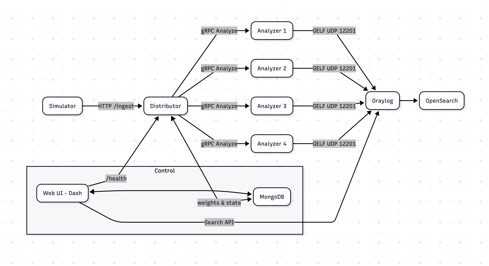
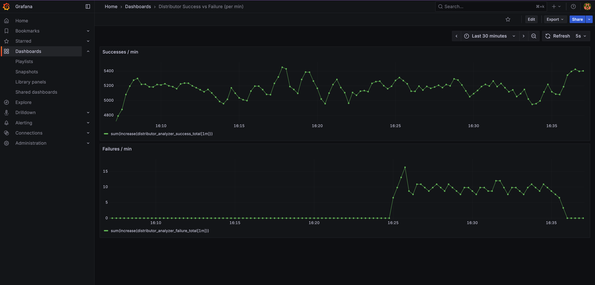

# 1. Log Distribution & Monitoring System

A **multi-container** demo for generating log traffic and distributing it across analyzer containers by relative weight, with monitoring in a **Graylog + OpenSearch** stack.  The included Web UI allows the ability to observe the distibution of logs by analyzer name in real-time, and analyzer failures can be simulated directly in the dashboard. Circuit breakers are used to avoid sending traffic to unhealthy analyzers, and the dashboard allows observing the state of each analyzers circuit breaker. 

- **Simulator**: generates HTTP log traffic.
- **Distributor (FastAPI + gRPC clients)**: routes packets to gRPC analyzers
- **Analyzers (gRPC servers)**: forward logs to **Graylog** via GELF.
- **Dashboard (Plotly/Dash)**: allows real-time observation of log distributions and simulated analyzer failures
- **Grafana (Prometheus)**: Analyzer request successes/min & failures/min during simulated analyzer failure, to observe circuit breaker benefit.
- **MongoDB**: Stores weights and Analyzer On / Off states.
- **Bootstrap**: configures Graylog inputs and index rotation/retention.

---

## 2) Overall Arch Diagram



## 3) Components in Detail

### 3.1 Graylog Bootstrap, OpenSearch & Graylog
- Bootstrap script aaits for Graylog API, ensures:
  - **GELF UDP** input on `12201`.
  - **Default index set** with:
    - Size-based rotation (`INDEX_MAX_MB`).
    - Retention by count (`INDEX_MAX_COUNT`).
- Graylog UI: `http://localhost:9000` (demo creds: `admin`/`admin`).
- OpenSearch backs search/storage.

### 3.2 Distributor Service (FastAPI + grpc.aio)
- Endpoints
  - **POST `/ingest`** accepts packets
  - **GET `/health`**: current weights, analyzers, circuit breaker snapshots.
  - **GET `/metrics`**: prometheus scapes metrics for Grafana dash.
- **Circuit breakers** enable unhealthy analyzers to be skipped
- Uses one worker only (makes circuit breaker behavior easy to observe).

### 3.3 gRPC Analyzer Containers
- Receive packets, do trivial processing, emit to **Graylog** over **GELF UDP**.
- Include analyzer name as a searchable **prefix**.

### 3.4 Web UI (Plotly/Dash)
- **Bar chart**: real-time log counts per analyzer in last X seconds (queried via Graylog API).
- **Circuit Breaker real-time state**: observe current analyser status (`closed`, `open`, `half-open`), real-time consective failure counts, and recovery time in `open` state.
- **Manual Controls**: 
  - Manually change weights and observe distribution changes.
  - Simulate analyzer failures via On / Off toggle
  - Observe real-time circuit breaker state during simulated failures

### 3.5 MongoDB
- Persists **Weights** and On / Off states.

### 3.6 Simulator
- Multi-process async **HTTP generator**, randomized log packets at target QPS.

### 3.7 Prometheus + Grafana
- Prometheus scrapes `distributor:8000/metrics`.
- Grafana has one graph designed to confirm value of circuit breakers
  - Important point - Failures/min remains low, even when most analyzers are unhealthy

---

## 4) Quick Start

**Prereqs:** Docker & Docker Compose

```bash
# 1) Bring everything up
docker compose up -d --build

# 2) Project Web UI
open http://localhost:8080

# 3) Graylog UI
open http://localhost:9000   # get in with admin/admin

# 4) Distributor health
open http://localhost:8000/health

# 5) Grafana (successes/min & failures/min)
open http://localhost:3000   # get in with admin/admin
# Dashboard: "Distributor Success vs Failure (per min)"

# 6) Circuit breaker unit test
docker compose build distributor  && docker compose run --rm --no-deps -e PYTHONPATH=/app distributor     pytest -q app/tests/test_simple_circuit_breaker.py
```

---

## How Simulated Analyzer Failure Works
Toggling an analyzer OFF updates Mongo with the OFF state for that analyzer. The distributor’s poller reads the flag and excludes OFF analyzers from candidacy (weight becomes irrelevant). If no eligible candidate remains, the request errors.

## Circuit Breaker Mechanism
With enough failures, an analyzer’s breaker **opens**. After a timeout, it **half-opens** and accepts probes. In half-open state, enough successes closes it, while any failure during half-open state triggers immediate re-opening.

## What the Distributor “knows”
- The Distributor reads the **Weights** from Mongo, which it uses to distribute logs accordingly.
- However, it has to **infer** the **ON/OFF** states using circuit breakers however. It has no way of "knowing" simulated analyzer On/Off set in the Web UI. I want to clarify this point because while the On / Off states are also stored in Mongo (similar to the weights) they are not read by the Distributor container, only by the Analyzer containers for the purpose of simulating failures. 

## How Distributions Update in Real Time
The Dash UI polls Graylog every 3s (configurable) for recent logs per analyzer (searchable by analyer name prefix), and updates the bar chart. (For production, we would reduce Graylog polling frequency and avoid a brittle prefix).

## Observing State Change of Circuit Breakers in Web UI
On the Web UI, when an analyzer is toggled OFF, the distributor reacts, as the circuit breaker state for that analyzer can be observed to change to "open". When it is toggled back "ON", the state can be observed to change to "half-open", then to "closed".

## Observing theh Benefit of Circuit Breakers via Grafana 
On the Grafana graph below, all analyzers start in ON state, and we see close to zero analyzer request failures. Towards the right a bit, we can see that failures/min rises slightly when 3/4 analyzers are manually turned OFF in the Web UI. Importantly, the error state is still kept very low as the circuit breakers enable sending all logs to the still healthy analyzer. When the analyzers are turned back ON via Web UI, successes/min goes back to zero again.



## Other Implementation Notes
- All logs in a log packet go to the **same** analyzer.
- Weights need not sum to 1; only **relative** values matter.
- If all current weights `<= 0`, distributor falls back to an **even** distribution.
- Analyzer names are fixed in multiple places: (`analyzer1`…`analyzer4`).
- gRPC is overkill for the demo but representative of prod integration.

---

## Limitations and Possible Improvements

1. **Graylog Transport (GELF/UDP):** Graylog would be more resilent with **HTTP or TCP/TLS** and with a buffering mechanism.
2. **Observability depth:** I included only minimal metrics here in Grafana. It would be valuable to create more graphs to track latency in particular.
3. **Graylog Scalability:** I did not thoroughly explore Graylog / OpenSearch tuning or scalabilty constraints. Its likely it requires some tuning to perform adequately at scale and not be a bottleneck.
4. **Searching log counts by analyzer:** Using string prefix for searching is brittle. It would be better to use **structured GELF fields** (`analyzer:name`, etc.) for robust queries/aggregations.
5. **Unit Test Coverage:** As always, more test coverage would be better. The circuit breaker code was most in need of a test and that was included.
---


