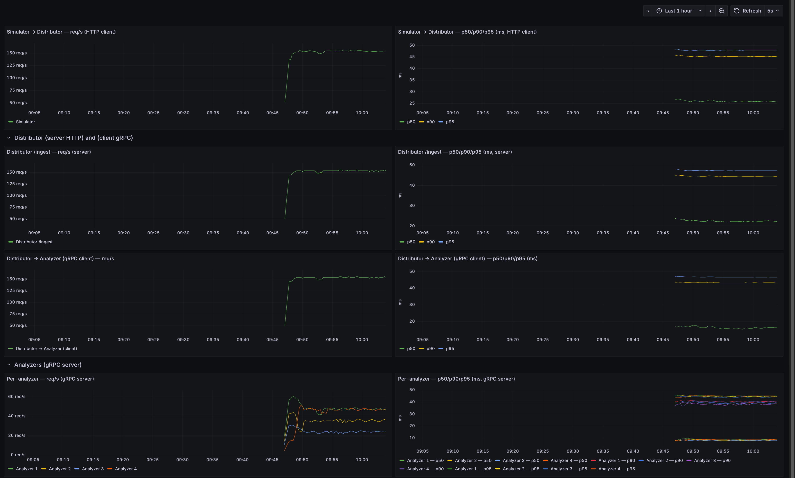

# 1. Log Distribution & Monitoring System

A **multi-container** demo for generating log traffic and distributing it across analyzer containers by relative weight, with monitoring in a **OpenTelemetry + Graylog + OpenSearch** stack.  The included Web UI allows the ability to observe the distribution of logs by analyzer name in real-time, and analyzer failures can be simulated directly in the dashboard. Circuit breakers are used to avoid sending traffic to unhealthy analyzers, and the dashboard allows observing the state of each analyzers circuit breaker. The entire E2E flow is fully instrumented with OpenTelemetry,

- **Simulator**: generates HTTP log traffic.
- **Distributor (FastAPI + gRPC clients)**: routes packets to gRPC analyzers.
- **Analyzers (gRPC servers)**: forward logs to **Graylog** via GELF.
- **Dashboard (Plotly/Dash)**: allows manual real-time control over weights and simulated analyzer failures. 
- **Grafana (Prometheus)**: Analyzer request successes/min & failures/min during simulated analyzer failure, to observe circuit breaker benefit.
- **MongoDB**: Stores weights and Analyzer On / Off states.
- **Graylog Bootstrap**: configures Graylog inputs and index rotation/retention.
- **OpenTelemetry**: Full instrumentation for distributed tracing + metrics.

---

## 2) Overall Arch Diagram


## 3) Components in Detail

### 3.1 Simulator
- Multi-process async **HTTP generator**, randomized log packets at target QPS.
- The assignment says it should accept messages from multiple "agents", in my case, I have multiple python processes in a single container, with MAX_WORKERS configurable in docker-compose.yaml

### 3.2 Distributor Service (FastAPI + grpc.aio)
- Endpoints
  - **POST `/ingest`** accepts packets
  - **GET `/health`**: current weights, analyzers, circuit breaker snapshots.
  - **GET `/metrics`**: prometheus scrapes metrics for circuit breaker Grafana dash (3.7)
- **Circuit breakers** enable unhealthy analyzers to be skipped
- Uses one worker only (makes circuit breaker behavior easy to observe). Gunicorn would support more than one worker if preferred.

### 3.3 gRPC Analyzer Containers
- Receive packets, do trivial processing, emit to **Graylog** over **GELF UDP**.
- Include analyzer name as a searchable **prefix**.

### 3.4 Web UI (Plotly/Dash)
- **Bar chart**: real-time log counts per analyzer in last X seconds (queried via Graylog API).
- **Circuit Breaker real-time state**: observe current analyzer status (`closed`, `open`, `half-open`), real-time consecutive failure counts, and recovery time in `open` state.
- **Manual Controls**: 
  - Manually change weights and observe distribution changes.
  - Simulate analyzer failures via On / Off toggle
  - Observe real-time circuit breaker state during simulated failures

### 3.5 MongoDB
- Persists **Weights** and On / Off states.

### 3.6 Grafana Dashboard for Latency and Requests / Sec
- Using OpenTelemetry  / Tempo  / Grafana 
- In dashboard "End-to-end Latency & Throughput"), we have fully instrumented the system with latency metrics and requests / sec at each stage of the system
- In addition, examination of individual traces allows us to see time spent throughout the entire system for individual requests.




### 3.7 Grafana Dashboard for Circuit Breaker Evaluation 
- Prometheus scrapes `distributor:8000/metrics` in the distributor service
- Grafana has one graph designed to confirm value of circuit breakers
  - Important point - Failures/min remains low, even when most analyzers are unhealthy


### 3.8 Bootstrap, OpenSearch & Graylog
- Bootstrap script waits for Graylog API, ensures:
  - **GELF UDP** input on `12201`.
  - **Default index set** with:
    - Size-based rotation (`INDEX_MAX_MB`).
    - Retention by count (`INDEX_MAX_COUNT`).
- Graylog UI: `http://localhost:9000` (demo creds: `admin`/`admin`).
- OpenSearch backs search/storage.

---

## 4) Quick Start

**Prereqs:** Docker & Docker Compose

```bash
# 1) Bring everything up
docker compose up -d --build

# 2) Project Web UI
open http://localhost:8080

# 3) Graylog UI
open http://localhost:9000   # get in with admin/admin

# 4) Distributor health
open http://localhost:8000/health

# 5) Grafana (two dashboards: 3.6, 3.7 )
open http://localhost:3000   # get in with admin/admin
# Dashboard: "Distributor Success vs Failure (per min)"

# 6) Circuit breaker unit test
docker compose build distributor  && docker compose run --rm --no-deps -e PYTHONPATH=/app distributor     pytest -q app/tests/test_simple_circuit_breaker.py
```

---

## 4. Breakdown of Graphs in Grafana Dashboard

### Row 1: Simulator → Distributor (HTTP client)
- **req/s (HTTP client)**: How many HTTP POSTs per second the Simulator sends.  
  *Measured at the `client.post(...)` call.*

- **p50/p90/p95 (ms, HTTP client)**: Latency percentiles for Simulator’s HTTP requests.  
  *Round-trip time of `client.post(...)`.*


### Row 2: Distributor (server HTTP)
- **Distributor /ingest — req/s (server)**: How many HTTP requests per second Distributor’s `/ingest` endpoint receives.  
  *Measured at the FastAPI `/ingest` handler.*

- **Distributor /ingest — p50/p90/p95 (ms, server)**: Latency percentiles for Distributor’s HTTP request handling.  
  *Covers request parsing, gRPC forwarding, and response.*


### Row 3: Distributor → Analyzer (gRPC client)
- **req/s (gRPC client)**: How many gRPC requests per second Distributor sends to Analyzers.  
  *Measured at `stub.Analyze(...)` calls.*

- **p50/p90/p95 (ms, gRPC client)**: Latency percentiles of Distributor’s gRPC calls.  
  *Round-trip time from request to Ack.*


### Row 4: Analyzers (gRPC server)
- **Per-analyzer — req/s (gRPC server)**: Requests per second handled by each Analyzer.  
  *Measured inside `AnalyzerService.Analyze`.*

- **Per-analyzer — p50/p90/p95 (ms, gRPC server)**: Latency percentiles for Analyzer’s gRPC server handler.  
  *Includes Graylog logging latency.*

---

## 5. How Simulated Analyzer Failure Works
A background thread in each analyzer constantly polls Mongo to see if it should simulate failure. If the analyzer sees the flag in Mongo indicating it should simulate failure, it will return an UNAVAILABLE status instead of storing any records in Graylog. This mechanism allows each analyzer's simulated failure status to be independently controlled in the Web UI.

## 6. Circuit Breaker Mechanism
With enough failures, an analyzer’s breaker **opens**. After a timeout, it **half-opens** and accepts probes. In half-open state, enough successes closes it, while any failure during half-open state triggers immediate re-opening.

## 7. What the Distributor “knows”
- The Distributor reads the **Weights** from Mongo, which it uses to distribute logs accordingly.
- However, it has to **infer** the **ON/OFF** states using circuit breakers. It has no way of "knowing" simulated analyzer On/Off set in the Web UI. I want to clarify this point because while the On / Off states are also stored in Mongo (similar to the weights) they are not read by the Distributor container, only by the Analyzer containers for the purpose of simulating failures. 

## 8. How Distributions Update in Real Time
The Dash UI polls Graylog every 3s (configurable) for recent logs per analyzer (searchable by analyzer name prefix), and updates the bar chart. (For production, we would reduce Graylog polling frequency and avoid a brittle prefix).

## 9. Observing State Change of Circuit Breakers in Web UI
On the Web UI, when an analyzer is toggled OFF, the distributor reacts, as the circuit breaker state for that analyzer can be observed to change to "open". When it is toggled back "ON", the state can be observed to change to "half-open", then to "closed".

## 10. Observing the Benefit of Circuit Breakers via Grafana dash
On the Grafana graph below, all analyzers start in ON state, and we see close to zero analyzer request failures. Towards the right a bit, we can see that failures/min rises slightly when 3/4 analyzers are manually turned OFF in the Web UI. Importantly, the error state is still kept very low as the circuit breakers enable sending all logs to the still healthy analyzer. When the analyzers are turned back ON via Web UI, successes/min goes back to zero again. The important point is that the error rate for the overall system was always low, even when 3 / 4 analyzers fail. 


## 11. Other Implementation Notes
- Weights need not sum to 1; only **relative** values matter.
- If all current weights `<= 0`, distributor falls back to an **even** distribution.
- Analyzer names are fixed in multiple places: (`analyzer1`…`analyzer4`).
- gRPC is overkill for the demo but representative of prod integration.

## 12. Total QPS Observed
- On my laptop, With Graylog, I get around 150 reqs / s, resulting in about 1300 logs added to Graylog every second.
- The clear bottleneck at the moment is the step where all logs are added to Graylog
- Removing Graylog, laptop can process around 600 reqs / s (observed)


## 13. Limitations and Possible Improvements

1. **Graylog Transport (GELF/UDP):** Graylog would be more resilient with **HTTP or TCP/TLS** and with a buffering mechanism.
2. **Graylog Scalability:** I did not thoroughly explore Graylog / OpenSearch tuning or scalability constraints. Its likely it requires some tuning to perform adequately at scale, and not run into space or memory issues.
3. **Searching log counts by analyzer:** Using string prefix for searching is brittle. It would be better to use **structured GELF fields** (`analyzer:name`, etc.) for robust querying by analyzer name.
4. **Unit Test Coverage:** As always, more test coverage would be better. The circuit breaker code was most in need of a test and that was included.
5. **Optimize Analyzer Service** - It would be ideal to fix / replace the for loop in the Analyzer Service with an async implementation or some type of background logging queue.
---
